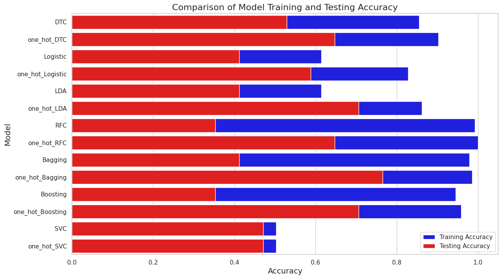

# Predicting 2024 Paris Olympics Results Based on Historical Data

**Authors:**
- Kelvin Wang
- Tuna Akmehmet
- Ethan Baird
- Arnav Singh

**Date:** August 18, 2024  
**Course:** Prof. Schwarze, Mathematics and AI (MATH 76.01)

---

## Introduction

One of the most renowned and much awaited athletic occasions in the world is the Olympic Games. Athletes from all over the world come together every four years to compete at the greatest and the hardest level, exhibiting their abilities and fighting for the most coveted Olympic gold. Sports analysts, coaches, and fans and viweres like us have always been interested in making predictions about results in such a fiercely competitive atmosphere.Knowing the elements that go into an athlete's success not only helps the athletes prepare better for competitions in the future but also gives non athletes like us important insights into the workings of elite sports. This research analyzes historical data from the previous 120 years of Olympic events to forecast the outcomes of the 2024 Olympic Games in Paris using machine learning techniques  we learned in MATH 76.01. Our goal in doing this analysis is to find patterns and trends that will help predict which competitors have the best chance of winning medals.

## Motivation

We had the idea of the significance of data-driven decision-making in sports as the driving force behind this project. The potential to revolutionize sports data analysis and prediction is growing along with the volume and variety of sports data. Predicting probable medal winners can have an impact on training plans, athlete selection procedures, and even sponsorship choices in the highly competitive Olympic setting. Our project, we believe, is a significant addition because it pushes the limits of predictive analytics in sports with an extensive Olympics dataset, creating new opportunities for competitive strategy and performance improvement.

## Methodology

### Data Preprocessing

The dataset utilized in this study (`athlete_events.csv`) includes various features related to athletes' performances across multiple Olympic Games. The initial steps of data preprocessing included:

- **Subsetting Relevant Features:** We selected variables likely to influence an athlete's performance, such as `Sex`, `Age`, `Height`, `Weight`, `NOC` (National Olympic Committee), `Year`, `Sport`, `Event`, and `Medal`.
- **Handling Missing Data:** The `Medal` column, which serves as the target variable, was filled with "No Medal" for missing entries to distinguish between medalists and non-medalists.
- **Encoding Categorical Variables:** We encoded categorical variables like `Sex` (0 for male, 1 for female) and `Medal` (0 for no medal, 1 for won a medal) to prepare them for model training.
- **Filtering the Dataset:** To ensure the model's relevance, we filtered the dataset to include only those events where a sufficient number of athletes had won medals (more than 50 medalists in each event).

### Feature Engineering

To further enhance the predictive power of our models, additional feature engineering was performed:

- **One-Hot Encoding:** Categorical features such as `NOC` were one-hot encoded to allow the machine learning models to interpret these variables effectively.
- **Balancing the Dataset:** The dataset was balanced by reducing the number of non-medalists to match the number of medalists, preventing the model from being biased towards predicting no medals.

### Model Selection and Training

We experimented with various machine learning models to predict whether an athlete would win a medal:

- **Decision Tree Classifier:** Used a Decision Tree model with a maximum of 20 leaf nodes to prevent overfitting. This model provides interpretable results by showing the decision-making process for classifying an athlete as a medalist or non-medalist.
- **Logistic Regression:** Employed to understand the linear relationships between the input features and the probability of winning a medal.
- **Linear Discriminant Analysis (LDA):** Used to model the relationships between the features and the target variable, assuming the data is normally distributed within each class.
- **Random Forest Classifier:** Trained to leverage the power of ensemble learning, combining the predictions of multiple decision trees to improve accuracy.
- **Bagging and Boosting Classifiers:** Explored Bagging (Bootstrap Aggregating) and Gradient Boosting techniques to further improve the model's performance by combining multiple weak learners.
- **Support Vector Classifier (SVC):** Used to classify the data by finding the optimal hyperplane that maximizes the margin between the classes.
- **k-Nearest Neighbors (kNN):** Implemented to predict the class of a given athlete based on the classes of their nearest neighbors in the feature space.

### Evaluation

Each model was trained and evaluated using the following metrics:

- **Training Accuracy:** Measures the accuracy of the model on the training set, indicating how well the model has learned the training data.
- **Testing Accuracy:** Measures the accuracy of the model on the testing set, providing an indication of the model's ability to generalize to new, unseen data.

The evaluation results were stored in a DataFrame to compare the performance of each model.

## Main Findings

Our analysis revealed that ensemble methods, such as Random Forest and Gradient Boosting, outperformed simpler models like Logistic Regression and Decision Trees in terms of both training and testing accuracy. These findings suggest that capturing the complex interactions between features is crucial for accurately predicting Olympic outcomes. The k-Nearest Neighbors model also showed competitive performance, particularly when the number of neighbors (k) was carefully chosen.

Despite these successes, the project also highlighted several challenges:
- **Data Imbalance:** Even after balancing the dataset, predicting medalists remains challenging due to the inherent unpredictability of sports outcomes.
- **Feature Importance:** Features such as `Height`, `Weight`, and `Age` were found to be important, but there may be other influential factors not captured in the dataset, such as training conditions, injuries, and psychological factors.

### Visual Aids

  
*Figure 1: Comparison of Model Performance in Terms of Training and Testing Accuracy.*

  
*Figure 2: Feature Importance as Determined by the Random Forest Model.*

## Learning Outcomes

We gained valuable learning experiences from this project in several areas:

- **Data Preprocessing:** As an essential first step in any data science project, all of the team members obtained practical expertise in cleaning and preparing data for analysis.
- **Modeling Techniques:** By investigating several machine learning models, we were able to understand more about how various algorithms function and when to use them.
- **Evaluation and Interpretation:** The project taught us how to evaluate the performance of the model and interpret the findings, emphasizing the significance of model evaluation.
- **Collaboration and Workflow:** We gained knowledge on how to coordinate efforts, oversee project workflows, and combine disparate project components to create a seamless whole.

## Author's Contribution Note

**Kelvin Wang:** Oversaw the feature engineering and data pretreatment tasks, making sure the dataset was clean and prepared for modeling.

**Tuna Akmehmet:** Contributed to the results interpretation, drawing conclusions from the model outputs and organizing the key findings.

**Ethan Baird:** Maintained an emphasis on implementing and assessing the performance of machine learning models, such as Random Forest, kNN, and Decision Trees.

**Arnav Singh:** Oversaw the project's process, making sure it moved forward on schedule and combining all of the different parts into the finished report.

## Conclusion

This project demonstrated the potential of machine learning models to predict Olympic outcomes based on historical data. While the models showed varying degrees of success, they also underscore the complexity of sports prediction. Future work could involve integrating more features, such as athletes' training regimes or recent performance metrics, to improve predictive accuracy.

As we move closer to the 2024 Olympics, these models could be further refined and used to generate insights and predictions that might be of interest to coaches, analysts, and sports enthusiasts. However, it's important to approach these predictions with caution, given the dynamic and unpredictable nature of sports competitions.
